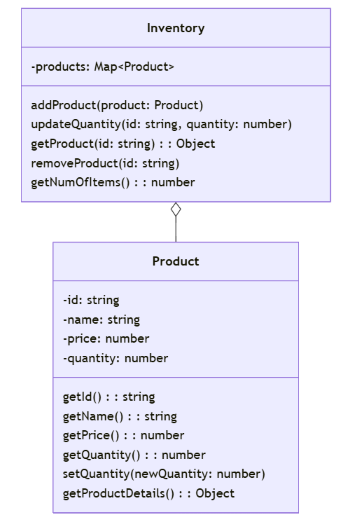

# Primer Challenge 4: OOP Stock Control System

## Learning Outcomes:

* Apply object-oriented programming principles (inheritance, polymorphism) in a practical scenario.
* Extend existing code to accommodate new requirements.
* Write robust and maintainable code with proper error handling.

Extend the provided inventory management program to support different product types with unique attributes.

*   **Clothing:** With attributes like `size` and `material`.
*   **Electronics:** With attributes like `brand` and `warranty`.

### Base Code:

The base code includes the following classes and methods:

*   **Inventory Class:**
    *   `addProduct(product)`
    *   `updateQuantity(id, quantity)`
    *   `getProduct(id)`
    *   `removeProduct(id)`

*   **Product Class:**
    *   `getProductDetails()`

`primer4.test.js` includes the current tests written for this code, and it currently passes them all.

### UML Class Diagram (Base Code)




**Tasks:**

1.  **Create Subclasses:**
    *   Create subclasses for `Clothing` and `Electronics` that inherit from the `Product` class.
    *   Add the specific attributes to each subclass.

2.  **Modify Hash Table:**
    *   Ensure that the hash table in the `Inventory` class can store objects of different product types.

3.  **Implement Polymorphic Functions:**
    *   Modify the methods in the `Inventory` class (`addProduct`, `updateQuantity`, `getProduct`, `removeProduct`) to handle different product types seamlessly.
    *   Ensure that the `getProductDetails()` method is overridden in the subclasses to include the unique attributes.

**Example Usage:**

```javascript
const inventory = new Inventory();

const tshirt = new Clothing('A123', 'T-shirt', 19.99, 100, 'L', 'Cotton');
const laptop = new Electronics('B456', 'Laptop', 799.99, 20, 'Dell', '1 year');

inventory.addProduct(tshirt);
inventory.addProduct(laptop);

const retrievedProduct = inventory.getProduct('B456');
console.log(retrievedProduct); // Should output the laptop details including brand and warranty
```

### UML Class Diagram (Extended version)


### Additional Considerations:

1. Error Handling: Ensure that your methods handle errors gracefully (e.g., trying to add a product with a duplicate ID).
1. Testing: Update `primer4.test.js` verify the functionality of your extended inventory management system.
1. Code Quality: Adhere to the provided programming standards for clear, maintainable code.


### Rubric for Primer 4


| Category | Fail (<40%) | Pass (40-59%) | Merit (60-69%) | Distinction (70-100%) |
|---|---|---|---|---|
| Functionality | Program does not correctly implement inheritance or polymorphism, or the extended functionality (adding, updating, retrieving different product types) does not work as expected. | Program demonstrates basic inheritance and polymorphism, but there are errors or limitations in handling different product types or edge cases. | Program correctly implements inheritance and polymorphism with mostly accurate handling of different product types. Minor errors or edge cases might exist. | Program flawlessly implements inheritance and polymorphism, handles all product types correctly, and functions as expected in all scenarios, including edge cases and error handling. |
| Testing | Little to no evidence of testing, or tests are poorly written and do not cover core functionality, inheritance, or polymorphic behaviour. | Basic test cases are present, but coverage is limited, and some critical paths or inheritance scenarios are not tested. | Test suite covers most functionality, including inheritance and polymorphism, demonstrating good understanding of test-driven development. Some edge cases might be missing. | Comprehensive test suite with excellent coverage, including inheritance, polymorphism, edge cases, and error handling. Tests are well-structured and maintainable. |
| Code Quality & Standards | Code is poorly organised, difficult to read, and does not meet basic programming conventions. Inheritance and polymorphism are not implemented in a clear and understandable way. | Code is somewhat organised, but readability could be improved. Inheritance and polymorphism are implemented, but with some inconsistencies or deviations from best practices. | Code is well-organised, readable, and mostly adheres to coding standards. Inheritance and polymorphism are implemented effectively, demonstrating a good understanding of object-oriented design principles. | Code is exemplary, demonstrating near-professional-level standards. Adheres to industry best practices and coding standards consistently. Inheritance and polymorphism are implemented in a clear, maintainable, and extensible way. |